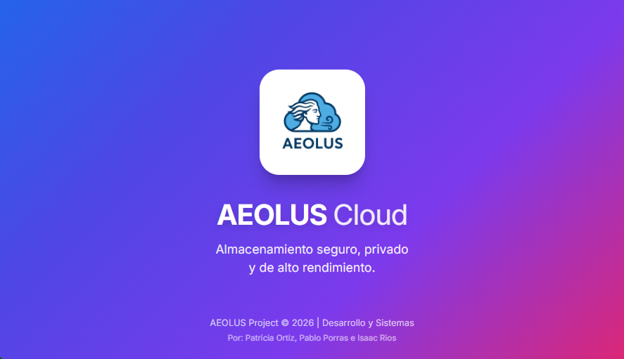
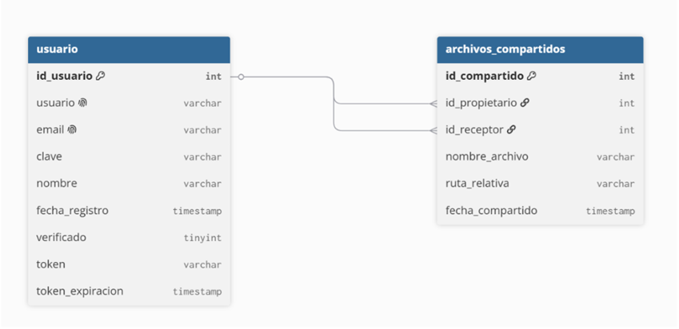
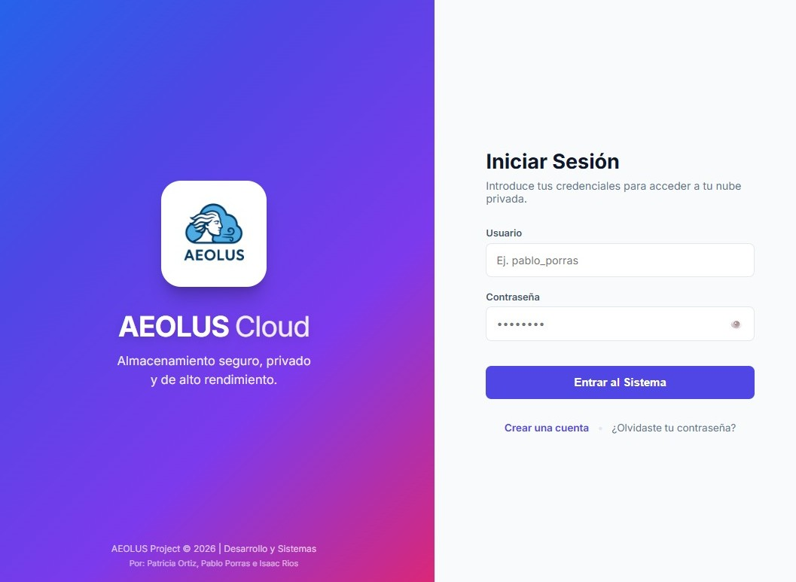
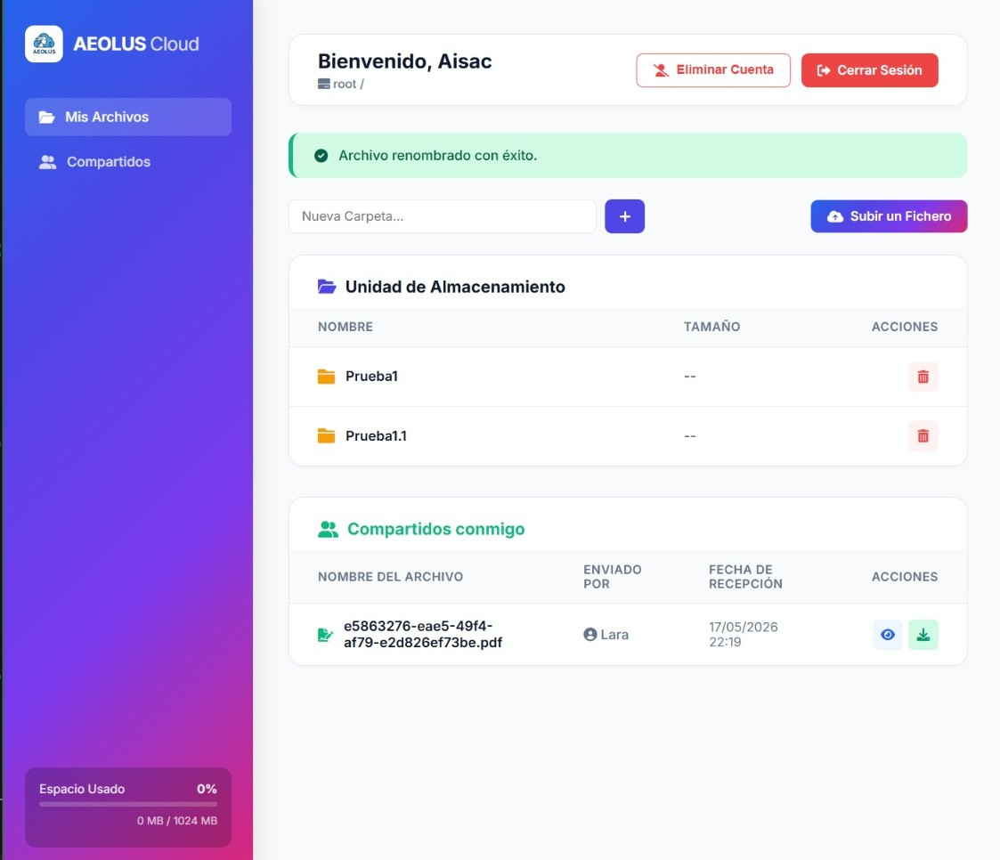

# ☁️ AEOLUS Cloud

<p align="center">
  
</p>

Aeolus Cloud es una plataforma de almacenamiento y gestión de archivos en la nube privada, diseñada bajo los principios de seguridad, privacidad y alto rendimiento. Este proyecto se ha desarrollado como entregable final para el Ciclo Formativo de Grado Superior en Administración de Sistemas Informáticos en Red (ASIR).

---

## 👥 1. Autores del Proyecto
El desarrollo, diseño e implementación de infraestructura ha sido llevado a cabo por el equipo:
* **Patricia Ortiz Fuentes**
* **Pablo Porras Vera**
* **Isaac Rios Reyes**

## 🎯 2. Descripción y Objetivo
El objetivo principal de Aeolus es proporcionar una alternativa privada y autogestionada a las nubes comerciales públicas. Permite a los usuarios registrados subir, descargar, gestionar y compartir archivos de forma segura dentro de una red privada virtual (VPN), garantizando que los datos nunca queden expuestos a la internet pública.

## 🛠️ 3. Tecnologías Utilizadas
El proyecto sigue una arquitectura LAMP/XAMPP adaptada a un entorno de red privada:
* **Frontend:** HTML5, CSS3 (Diseño responsivo y corporativo) y JavaScript (Interacciones del DOM).
* **Backend:** PHP 8.x (Lógica de servidor, enrutamiento y gestión de sesiones).
* **Base de Datos:** MySQL / MariaDB.
* **Infraestructura:** Servidor Linux (Debian), Servidor Web Apache2 y Tailscale (MagicDNS y enrutamiento VPN).
* **Dependencias:** PHPMailer (Envío de correos SMTP) y vlucas/phpdotenv (Gestión de variables de entorno).

## 🗄️ 4. Esquema Entidad-Relación (E/R)
La arquitectura de la base de datos ha sido refactorizada y optimizada para la máxima eficiencia y simplicidad, reduciendo la complejidad a **dos tablas principales** altamente normalizadas:
1. **Usuario:** Almacena credenciales (hashes bcrypt), tokens de recuperación temporal y datos de verificación.
2. **Archivos** *(Nota: cambia esta palabra si tu segunda tabla se llama de otra forma)*: Gestiona los metadatos del almacenamiento, enlazados mediante clave foránea al usuario propietario.

<p align="center">
  
</p>

## ⚙️ 5. Requisitos Previos (Prerrequisitos)
Para desplegar este proyecto en un entorno de desarrollo o producción, se necesita:
* Un servidor Apache con PHP 8.0 o superior.
* Base de datos MySQL/MariaDB.
* Composer instalado (para la gestión de dependencias).
* Cliente de Tailscale (para acceso a la VPN de producción).

## 🚀 6. Instalación y Despliegue

1. **Clonar el repositorio:**
   ```bash
   git clone https://github.com/Blue-Drink/AEOLUS.git
   cd AEOLUS
   ```

2. **Instalar dependencias de PHP:**
   ```bash
   cd backend
   composer install
   ```

3. **Configurar el entorno seguro:**
   Crear un archivo `.env` en el directorio `backend/` basado en la plantilla de desarrollo, especificando las credenciales de la DB, SMTP y la IP de la VPN:
   ```env
   DB_HOST="localhost"
   DB_USER="tu_usuario"
   DB_PASS="tu_contraseña"
   DB_NAME="Aeolus_Cloud"
   SMTP_USER="tu_correo@gmail.com"
   SMTP_PASS="tu_clave_de_aplicacion"
   APP_URL="http://100.x.x.x"
   ```

4. **Desplegar la base de datos:**
   Importar el archivo `database/aeolus_schema.sql` en el gestor MySQL.

5. **Configurar Apache (Producción):**
   Asegurar que el `DocumentRoot` del VirtualHost apunta directamente a `/ruta/del/proyecto/frontend/web`.

## 🔄 7. Integración y Despliegue Continuo (CI/CD)
El proyecto mantiene un flujo de despliegue continuo automatizado mediante Git. Los desarrolladores integran sus parches (fixes/features) en ramas locales, resuelven conflictos y fusionan con `main` en GitHub. El servidor de producción en Debian se actualiza de forma transparente mediante peticiones `pull` directas a través de SSH, garantizando cero caídas del servicio (Zero Downtime Deployment) durante las actualizaciones de infraestructura.

## 📖 8. Guía de Uso (Tutorial Rápido)
* **Registro:** El usuario accede a la ruta raíz y crea una cuenta validando su correo electrónico.
* **Acceso Seguro:** Autenticación mediante contraseña encriptada.
* **Panel Principal:** Interfaz gráfica para la subida de ficheros (Drag & Drop o explorador), creación de carpetas y listado de documentos.
* **Recuperación de Acceso:** Sistema de envío de tokens por correo electrónico con caducidad de 1 hora para el restablecimiento de credenciales de forma segura.

<p align="center">
  
  
</p>

## 🔒 9. Seguridad Implementada
* **Aislamiento de Entorno:** Uso estricto de archivos `.env` (ignorados por Git) para evitar la filtración de credenciales.
* **Hashes Criptográficos:** Contraseñas almacenadas usando `PASSWORD_DEFAULT` (Bcrypt) en PHP.
* **Capa de Red:** Acceso restringido a través de la red criptográfica de Tailscale (IPs 100.x.x.x), bloqueando el acceso público al puerto 80 del servidor.
* **Tokens Efímeros:** Control de caducidad por timestamps para recuperación de cuentas.

## 🐛 10. Estado del Proyecto y Bugs Conocidos
* **Estado actual:** Finalizado / Release Candidate 1.0.
* Limitaciones de la versión actual:** Por motivos de gestión de infraestructura, la capacidad de almacenamiento se ha limitado de momento a 1 GB por usuario.
* **Futuras ampliaciones (Roadmap):** Se plantea la implementación de un sistema de cuotas escalable. Esto permitirá ofrecer diferentes volúmenes de almacenamiento en función de distintos perfiles de usuario o planes de suscripción.

## 🌍 11. URL de Despliegue
La aplicación está desplegada en producción a través de nuestra red VPN privada (Tailscale) para garantizar el aislamiento. 
* **URL:** `https://debian-aeolus.taildaa0bc.ts.net`

## 🎥 12. Vídeo Demostración
* **Enlace al vídeo:** [https://youtu.be/_4fhdJ3K9mA] 

## 📚 13. Bibliografía y Recursos Técnicos Consultados
* **Debian Project (2026):** *Debian 12 (Bookworm) Official Documentation*. Utilizado para el despliegue del sistema operativo bare-metal y la gestión de permisos. Recuperado de: https://www.debian.org/doc/
* **MariaDB Foundation (2026):** *MariaDB Server Knowledge Base*. Consultado para el diseño relacional, configuración del motor de base de datos y hardening del servicio. Recuperado de: https://mariadb.com/kb/en/
* **Tailscale Inc. (2026):** *Tailscale Documentation (WireGuard Mesh VPN)*. Referencia principal para la configuración de túneles P2P, evasión de CG-NAT y securización de la red. Recuperado de: https://tailscale.com/kb/
* **The PHP Group (2026):** *PHP 8 Manual: Seguridad y variables de entorno*. Aplicado en la mitigación de inyecciones SQL (Consultas Preparadas) y cifrado de contraseñas. Recuperado de: https://www.php.net/manual/es/
* **PHPMailer (2026):** *PHPMailer Official Repository*. Utilizado para la configuración de la pasarela de envíos SMTP mediante TLS. Recuperado de: https://github.com/PHPMailer/PHPMailer

## 📄 14. Licencia
Este proyecto es de carácter académico. Los recursos gráficos y código fuente se han desarrollado exclusivamente para la evaluación del proyecto intermodular de ASIR.